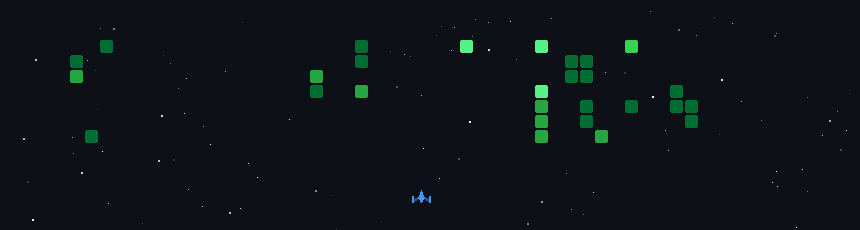

<div align="center">


<br/>


&nbsp;


</div>

---


## `~/whoami`

```cpp
class IlyasAlee {
public:
    const string degree   = "B.Tech CSE (AI & ML) — 3rd Year";
    const string location = "India 🇮🇳";
    const string research = "BYOD Classroom Productivity Framework → IEEE";
    const string patent   = "AI-based patent — in progress 🔬";

    vector<string> currently = {
        "⚙️  Retro OS Dev (C / C++ / Assembly)",
        "🧠  Competitive Programming grind",
        "📡  Embedded systems & hardware builds",
        "📄  GitHub portfolio + research publications"
    };

    string ask_me_about = "C++, IoT, ML, OS internals";
    string reach_me_at  = "aleeilyas14@gmail.com";
    string fun_fact     = "QWERTY keyboard was designed to slow you down.";
};
```


---

## 🔭 What I'm Working On

> 🧠 **[ClassPuls — BYOD Productivity Framework](https://github.com/ilyas-dar/classpuls-Securing-BYOD-Productivity-in-Classroom)** — Predicts student productivity from behavioral signals using Logistic Regression + Random Forest. IEEE-style paper with full system architecture, math, and visualizations.

> 🖥️ **[Retro OS Development](https://github.com/ilyas-dar/OS-development-)** — Building an OS from scratch. Bootloader → scheduler → memory management → filesystem → terminal. Pure C, C++, Assembly.

> 🛸 **ESP32 Game Suite** — Space Battle, Dino Runner, Flappy Bird — all on microcontrollers with OLED displays, joystick input, buzzers, custom sprite animations.

> 📡 **[ESP32 Radar + IoT](https://github.com/ilyas-dar/ESP32-Radar-System)** — Sensor fusion with DHT11 + LDR feeding into OLED and Blynk app in real time.


---

## 🛠 Tech Stack

<div align="center">


<br/>


<br/><br/>


</div>


---

## 📊 GitHub Stats

<div align="center">


&nbsp;


<br/>


</div>

---

## 📈 Activity & Summary

<div align="center">


&nbsp;


<br/>


&nbsp;


<br/>


</div>

---

## 🏆 Trophies

<div align="center">


</div>


---

## 🛸 Space Shooter — Contribution Graph

<div align="center">

> *Every commit is a bullet. Every streak is a wave cleared.*



</div>


---

## 🌐 Connect

<div align="center">

<a href="https://linkedin.com/in/ilyasdar">

</a>
&nbsp;
<a href="https://instagram.com/ilyas_alee_">

</a>
&nbsp;
<a href="https://leetcode.com/u/ily_asalee">

</a>
&nbsp;
<a href="https://www.hackerrank.com/aleeilyas14">

</a>
&nbsp;
<a href="mailto:aleeilyas14@gmail.com">

</a>

<br/><br/>


</div>


